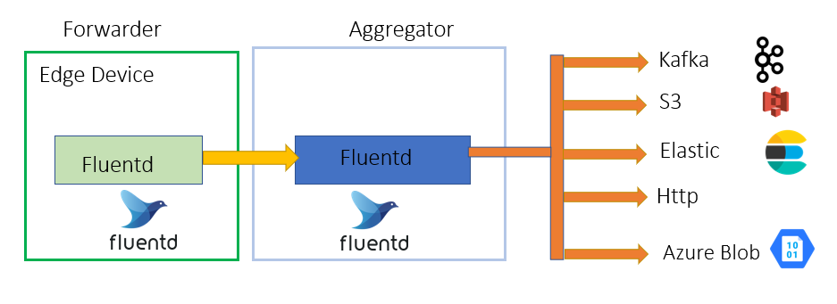

# Fluent Example
Fluentd forwarder aggregator example


## Prerequisite
1. [Python 3.8.5](https://www.python.org/downloads/release/python-385/)
2. [Docker](https://www.docker.com/)   

## Setup
Configure the following files

```
forwarder/Configuration/fluent_tail.conf
datagen.py
```

Start the docker of forwarder and aggregator and run the datagen.

## Further Reading
[Medium](https://medium.com/@masterappu/data-transfer-in-edge-2245a49d95d)

